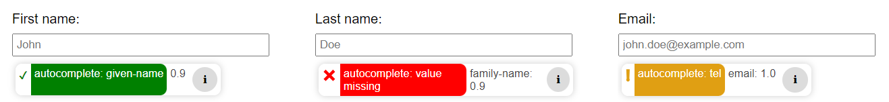

# Autocomplete-Check
This is a Chrome plugin for testing Websites against WCAG 2.1 Success Criterion 1.3.5: Identify Input Purpose.

## How to use
1. pin the installed plugin to your browser-toolbar
2. click the plugin icon to enable the extension

## Build and Run
You may skip building the plugin yourself, by downloading the shipped "/dist"-folder and skipping the first two steps.
1. run `npm run build`
2. output will be saved in "/dist"-folder
3. open Chrome-Browser
4. go to "chrome://extensions"
5. enable Developer mode (switch at top right)
6. click "Load unpacked" and select "/dist"-folder

## Setup Development-Environment
1. clone repo
2. make sure TypeScript is installed
3. run `npm install`

## Translations
Special thanks to [Roel](https://github.com/roelvangils) from [Eleven Ways](https://elevenways.be/en) for providing dutch (and belgian dutch) translations / keywords!
